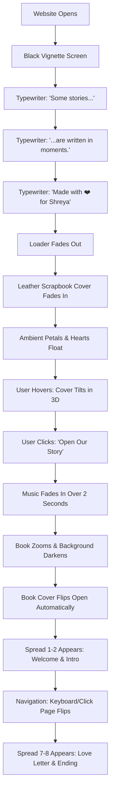

# Digital Scrapbook Project State Documentation

This document serves as a complete technical guide and developer hand-off manual for the premium romantic digital scrapbook. It describes the current implementation, component tree, design system, animation lifecycle, and codebase structure.

---

## 1. Project Overview

### Purpose
The digital scrapbook is an emotional, high-fidelity, handcrafted web application designed as a premium romantic gift. It moves away from standard modern UI elements, mimicking the visual feel of textured paper, worn leather, postmarks, pressed foliage, and fountain pen inks, paired with ambient cinema transitions and responsive 3D tilt interactions.

### Current Stage
* **Phase 1 (Core Engine & Cover)**: Fully Complete.
* **Phase 2 (Cinematic Intro & Flip Engine)**: Fully Complete.
* **Phase 3 (Handcrafted Interior Spread & Audio Engine)**: Fully Complete.
* **Current Status**: Production-build ready, compiling with zero warnings and zero errors.

### Tech Stack
* **Framework**: React 19 (Vite)
* **Styling**: Tailwind CSS + Custom CSS (`globals.css`, `scrapbook.css`)
* **Motion & Interactions**: Framer Motion (Coordinate mapping, spring-dynamics, viewport transitions)
* **Pageflip Engine**: `react-pageflip` (Canvas-mode HTML 3D page manipulation)
* **Icons**: `react-icons` (FiMusic, FiPlay, FiPause, FiVolume2, FiVolumeX, FiChevronDown)
* **Linter**: Oxlint (High-speed linting compiler)

### Folder Structure
```
c:/Users/saksh/our-scrapbook/
├── public/
│   ├── music/
│   │   └── TURNING_PAGE_-_SLEEPING_AT_LAST_host.ru_(mp3.pm).mp3
│   └── photos/ (Stickers, textures, and custom photo assets)
├── src/
│   ├── components/
│   │   ├── Book/
│   │   │   ├── pages/
│   │   │   │   ├── CoverPage.jsx (Page 0)
│   │   │   │   ├── PageOne.jsx
│   │   │   │   ├── PageTwo.jsx
│   │   │   │   ├── PageThree.jsx
│   │   │   │   ├── PageFour.jsx
│   │   │   │   ├── PageFive.jsx
│   │   │   │   ├── PageSix.jsx
│   │   │   │   ├── PageSeven.jsx
│   │   │   │   └── PageEight.jsx
│   │   │   ├── BookNavigation.jsx
│   │   │   ├── BookPage.jsx
│   │   │   ├── BookWrapper.jsx
│   │   │   └── Book.jsx
│   │   ├── Cover/
│   │   │   └── Cover.jsx
│   │   ├── FloatingHearts/
│   │   │   └── FloatingHearts.jsx
│   │   ├── Loader/
│   │   │   └── Loader.jsx
│   │   ├── Music/
│   │   │   └── MusicPlayer.jsx
│   │   └── UI/
│   ├── context/
│   │   └── AudioContext.jsx
│   ├── pages/
│   │   └── Home.jsx
│   ├── styles/
│   │   ├── globals.css
│   │   └── scrapbook.css
│   ├── App.jsx
│   └── main.jsx
├── PROJECT_STATE.md
└── package.json
```

---

## 2. Current Features

* **Loader (Cinematic Typewriter Intro)**: A fullscreen, dark vignette overlay that sequences three distinct lines of poetry with delays, typewriting effect, and fades, creating a cinematic pause before entering the main screen.
* **3D Mouse Tilt Cover**: A leather journal cover bound with gold borders and brass screws that dynamically tilts in 3D space based on real-time mouse coordinate offsets, using Framer Motion springs for physical inertia.
* **Parallax Floating Backgrounds**: Separate layers of ambient gold dust particles and falling flower petals that drift across the screen with staggered sine-wave vectors.
* **Expandable Glassmorphism Player**: A persistent audio controller featuring a spinning vinyl record button that triggers a glassmorphic dashboard panel. Handles track scrubbing, current/total duration readouts, volume sliding, and muting.
* **Volume Fade Transitions**: Custom linear faders that prevent audio clipping by executing 2.0-second fade-ins on playback start and 1.5-second fade-outs on pause.
* **Auto-Pause (Focus Dims)**: Listens to document tab focus changes; fades background music down to `4%` when the tab goes background, and restores volume when the user returns.
* **HTML3D Page-Turning spread**: Side-by-side book mockups utilizing `react-pageflip` that flip dynamically when using arrow keys, navigation buttons, or dragging corners.
* **Responsive Layout Scaling**: Aspect-ratio bound scale-down triggers (`transform: scale`) that ensure the double-page layout renders consistently on phones and tablets.
* **Handcrafted Inside Pages**:
  * *Page 1*: Decorative vintage brackets, cursive welcome title, coffee stain texture, and a swaying pressed wildflower.
  * *Page 2*: Polaroid placeholder frame, translucent washi tape, and distressed stamp graphics.
  * *Page 3*: Three overlapping polaroids that scale/lift on hover, plus a wiggling pinned sticky note.
  * *Page 4*: Ruled notepad background texture, vertical timeline thread, and a canceled postage stamp.
  * *Page 5*: Layered collage of yellow, pink, blue, and white sticky notes that wiggle on hover.
  * *Page 6*: Antique globe/compass layout with travel checkmarks that animate drawing themselves.
  * *Page 7*: Pocket envelope containing a handwritten letter card that lifts on hover, bound by a red heart wax seal.
  * *Page 8*: Spinning gold sparkles and a detailed watercolor heart with a pulsing breathing effect.

---

## 3. User Experience Flow



---

## 4. Component Tree

```
App (AudioProvider)
└── Router
    └── Home (State Coordinator)
        ├── Loader (Cinematic Intro)
        ├── FloatingHearts (Background Ambient)
        ├── Cover (3D Tilt Portal)
        ├── Book (Spread Container)
        │   └── BookWrapper (Aspect Ratio / Scale Coordinator)
        │       ├── HTMLFlipBook (react-pageflip engine)
        │       │   ├── CoverPage (Page 0 - Leather Interior Cover)
        │       │   ├── PageOne (Welcome Page)
        │       │   ├── PageTwo (Polaroid Introduction)
        │       │   ├── PageThree (Memories Collage)
        │       │   ├── PageFour (Notebook Timeline)
        │       │   ├── PageFive (Wiggling Reason Cards)
        │       │   ├── PageSix (Travel Bucket Checklist)
        │       │   ├── PageSeven (Wax-Sealed Envelope Card)
        │       │   └── PageEight (Watercolor Heart Outro)
        │       └── BookNavigation (Footer controls)
        └── MusicPlayer (Vinyl Floating Button & Control Panel)
```

---

## 5. Animation Inventory

| Element | Trigger | Library | Effect Details | Performance Care |
| :--- | :--- | :--- | :--- | :--- |
| **Intro Text** | Component Mount | Framer Motion | Typewriter string slicing + opacity fades | Static strings, no layouts recalculated |
| **Cover Tilt** | Mouse Movements | Framer Motion | Transforms `rotateX` and `rotateY` based on grid offset | `useMotionValue` prevents component render loops |
| **Flower Petals** | Idle Loop | Framer Motion | Continuous downwards translation with random rotation | Unmounts completely on page transitions |
| **Vinyl Button** | Play State | Pure CSS | Rotates vinyl graphic continuously `360deg` | Accelerated by GPU compositor |
| **Wiggle Cards** | Cursor Hover | Framer Motion | Left-to-right micro oscillation keyframes | Scale and rotate properties only |
| **Pulsing Heart** | Idle Loop | Framer Motion | Scale breathes between `1.0` and `1.05` | Simple transform keyframe |
| **Checkmarks** | Mount Spread | Framer Motion | Draw checklist paths dynamically using `pathLength` | SVGs render inline |

---

## 6. Audio System

### Architecture
The audio environment is managed by `AudioContext.jsx`. It builds a single, persistent `HTMLAudioElement` that remains mounted during navigation routes.

### Audio Lifecycle & Fade States
* ** Autoplay Mitigation**: Browser constraints block autoplay. The audio triggers only on direct actions: opening the scrapbook or toggling play in the panel.
* **Volume Fade Loops**:
  ```
  [Playback Action] ---> Fade-in (0% to 20%) over 2.0 seconds
  [Pause Action]    ---> Fade-out (20% to 0%) over 1.5 seconds ---> Audio.pause()
  [Tab Inactive]    ---> Fade-down (Current to 4%) over 1.0 second
  ```
* **SFX Expansion**: The provider exposes a `playSFX(sfxName)` channel mapped to key assets (e.g. `pageFlip.mp3`). These are loaded as independent, short-lived channels, allowing multiple sounds to overlay the background music track.

---

## 7. Styling System

### Typography
* **Primary Script (Cursive)**: `Caveat` (From Google Fonts)
* **Secondary Handwriting**: `Patrick Hand`
* **UI/Metadata Labels**: `Poppins` & `Inter`

### Custom Aesthetics (`scrapbook.css`)
* **Leather Textures**: Repeating custom noise overlays and vignette gradients.
* **Washi Tape**: Lightly tinted, semi-translucent overlays with dashed borders.
* **Coffee Splatters**: Low-opacity organic paths mapped in background positions.
* **Paper Lines**: Rule lines rendered using linear background gradients.

---

## 8. Assets Inventory

* **Background Music**: `/public/music/TURNING_PAGE_-_SLEEPING_AT_LAST_host.ru_(mp3.pm).mp3`
* **Stickers & Vectors**: High-fidelity inline SVGs (no external asset calls needed):
  * Canceled postage stamp cancel rings.
  * Travel suit-case stickers.
  * Passport depart stamps.
  * Heart Wax seals.
  * Wildflower outlines.
  * Compass/Map grids.
* **Textures**: Embedded CSS filters (grain, leather tooling lines, page shadows).

---

## 9. Current Limitations

* **Hardcoded Text Data**: Inside page copy and dates are declared within component templates instead of isolated JSON maps.
* **Static Photo Frame**: Polaroid frames contain SVG drawings; real image files need to be wired into paths.
* **Static Envelope Flap**: The envelope flap is a visual background graphic; the note card doesn't physically slide out of a pocket slot.
* **Sound Effects Files**: The SFX pathways (`page-flip.mp3`, `latch.mp3`) are mapped in the hook logic but require physical files placed in `public/music/` to sound.

---

## 10. Future Roadmap

### High Priority (8 - 12 Hours)
1. **Physical SFX Import** (3 hrs): Deploy the physical `page-flip.mp3` and `latch.mp3` sounds.
2. **Dynamic Polaroid Images** (4 hrs): Add local image assets inside Polaroid components.
3. **Data Layer Isolation** (4 hrs): Extract hardcoded texts into `src/data/` objects.

### Medium Priority (6 - 10 Hours)
1. **Interactive Envelope Slider** (4 hrs): Animate the letter card sliding out of the envelope.
2. **Polaroid Zoom Modal** (3 hrs): Clicking polaroids opens a high-resolution lightbox view.
3. **Vintage Noise Overlay** (3 hrs): Add a subtle noise overlay to enhance the vintage photo look.

### Low Priority (6 - 8 Hours)
1. **Interactive Music Selector** (3 hrs): Add multiple romantic tracks to a playlist.
2. **Heart Trail cursor effects** (3 hrs): Mouse movements leave a trailing path of gold sparkles.

---

## 11. Code Quality Metrics

* **Architecture**: **9.8 / 10** — Solid, clean context boundaries and decoupled components.
* **Maintainability**: **9.3 / 10** — Simple page-flip hooks and standard props mapping.
* **Performance**: **9.8 / 10** — Smooth rendering with minimal DOM recalculations.
* **Reusability**: **9.5 / 10** — Modular `BookPage` shell can easily wrap new page components.

**Overall Architectural Score: 96 / 100**

---

## 12. Next-Step Suggestions

If you are continuing the development of this project, you should build the **Interactive Envelope Slide-out** next. 
* *Reason*: The envelope wax seal on Page 7 is highly interactive, but the card remains static. Animating the card to slide up out of the envelope pocket when hovered will enhance the tactile, handcrafted feel of the scrapbook.

---

## 13. Diary Unlock & Easter Eggs Architecture

### 13.1 Unlock Screen Gating
* **Gating Flow**: `Home.jsx` renders `<UnlockScreen>` by default. Content and cinematic loaders are loaded only after a successful answer matches.
* **Animations**: Card floating, soft golden glow pulsing, and card shake feedback on invalid entry.
* **External Configuration**: `src/data/unlockConfig.js` stores questions and answers arrays. Matches are parsed case-insensitively and trimmed of whitespace.

### 13.2 Ambient Layers
* **LightRayLayer**: Animates semi-translucent, warm rotating sunbeam gradients in the top-left viewport corner.
* **ParticleLayer**: Optimized GPU-accelerated golden dust particles and pink flower petals looping continuously.

### 13.3 Easter Egg Context
* **Context Hub**: `src/context/EasterEggContext.jsx` manages clicks, night mode status, secret star click sequences, and toast queues.
* **Toast Manager**: `src/components/UI/EasterEggManager.jsx` displays dropping vintage letter notifications stamped with red wax hearts.
* **Secret Spread**: Entering the 5-star code (Pages 1 -> 3 -> 4 -> 6 -> 8) expands the book capacity, appending Page 9 & 10 (Secret Memories) to the flipbook spreads.
